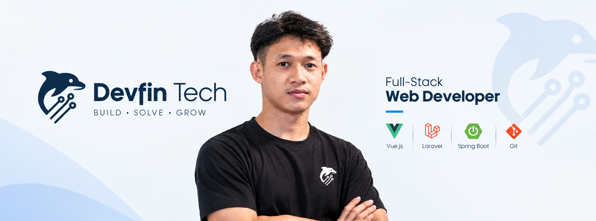

👋 Hi, I'm Leng Lykoura

Full-Stack Web Developer · Devfin Tech.

I build modern, scalable web applications with a focus on clean code, practical solutions, and great user experiences.

🚀 About Me

I'm a Full-Stack Web Developer passionate about turning ideas into reliable, maintainable, and user-friendly digital products.

💻 Building full-stack web applications

🧩 Designing clean and scalable application architectures

⚡ Focused on performance, usability, and maintainability

🔧 Enjoy solving real-world engineering problems

🌱 Continuously learning new technologies and best practices

🚀 Building with Devfin Tech.

🛠️ Tech Stack

Frontend

  

Backend

  

Database & Infrastructure

  

Tools

  

💡 What I Build

Area

Focus

🌐 Web Applications

Modern, responsive, production-ready applications

🔌 APIs

RESTful APIs and backend integrations

🗄️ Databases

Reliable data models and efficient queries

🎨 UI/UX

Clean interfaces with practical user flows

⚙️ System Architecture

Maintainable and scalable application structures

🚀 Deployment

Development, deployment, and production workflows

📌 Featured Projects

🏗️ Devfin Tech

Full-Stack Web Development

A personal technology brand focused on building practical web solutions.

Focus: Full-stack development · APIs · Modern web applications · Software architecture

💰 Loan Management System

A full-stack loan management platform designed to manage customers, loans, repayments, and related business workflows.

Stack: Laravel · Vue 3 · Vuetify · MySQL · Redis

📊 GitHub Activity

Replace YOUR_GITHUB_USERNAME with your actual GitHub username.

🎯 My Development Philosophy

Clean Code · Modern Tech · Real Solutions

I believe good software should be:

Simple — easy to understand and maintain

Scalable — ready to grow with the product

Reliable — designed to work consistently

Useful — focused on solving real problems

Maintainable — built for the developers who come next

🤝 Let's Connect

If you're interested in web development, software engineering, or building something useful, feel free to connect.

  
  

💻 WEB · IDEAS · IMPACT

Build today. Create better tomorrow.

